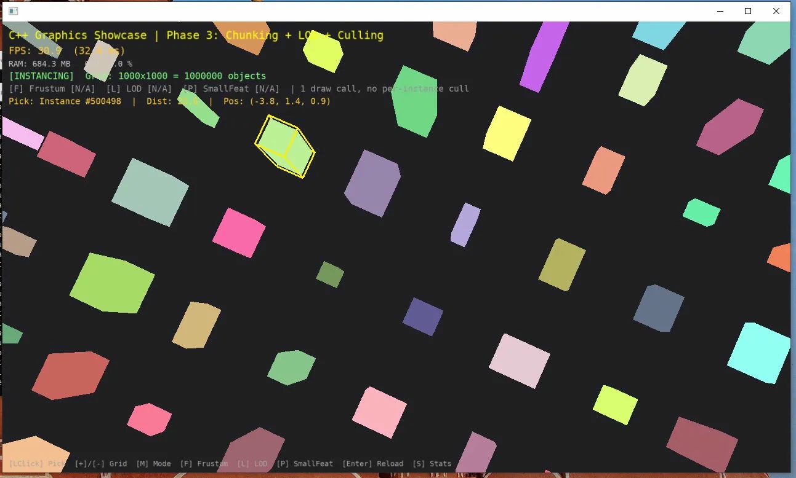
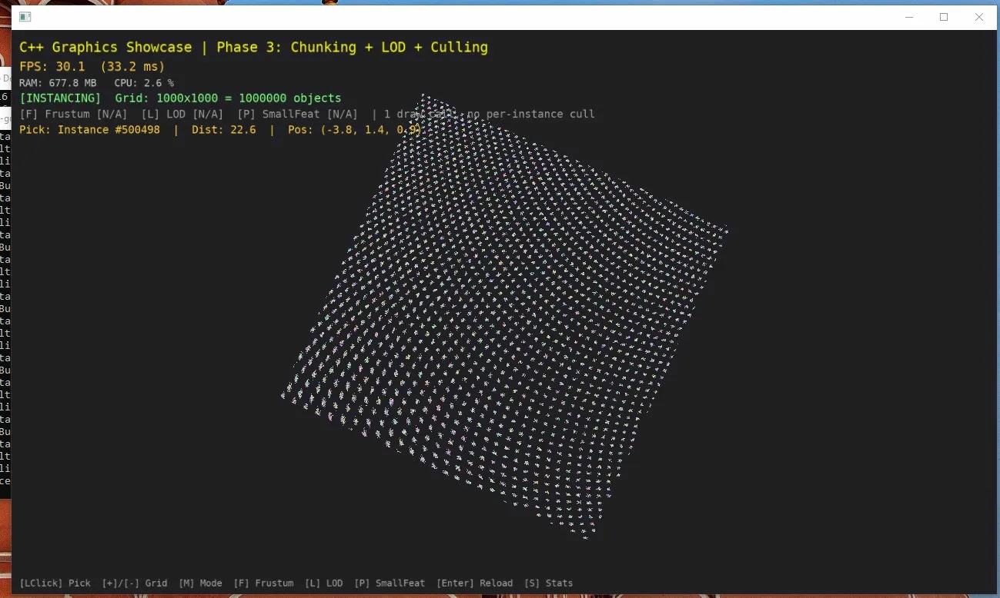
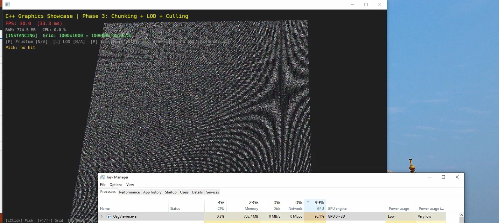
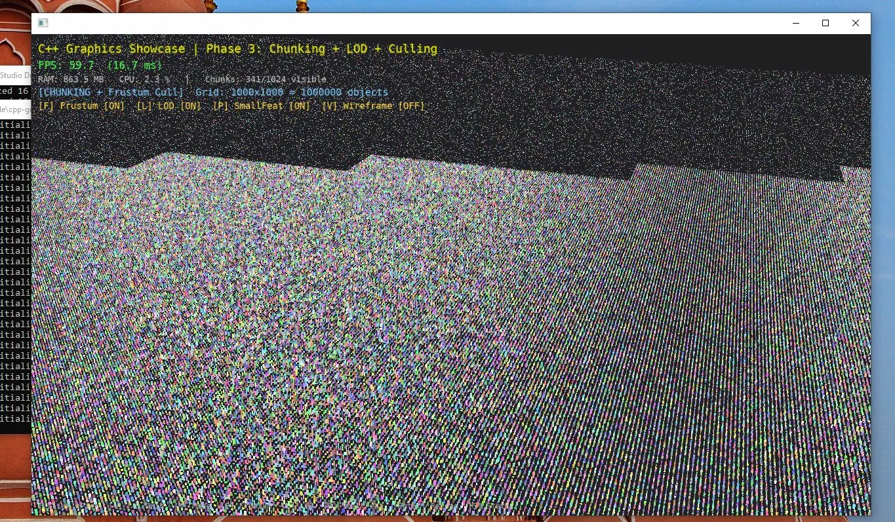
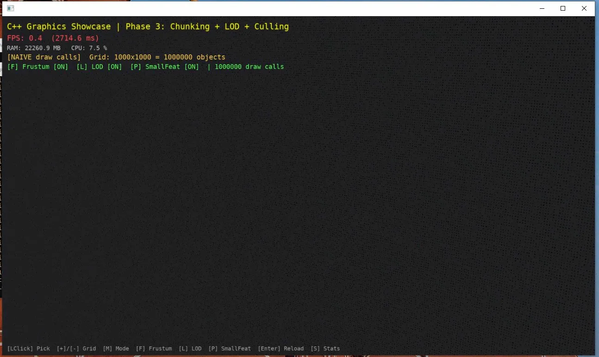

# C++ Graphics Showcase

> **Real-time 3D rendering demo** built with OpenSceneGraph & C++14  
> Showcasing hardware instancing, geometry chunking, multi-level LOD, frustum culling and BVH picking.
>
> **Demo hiển thị kỹ thuật rendering thời gian thực** với OpenSceneGraph & C++14  
> Bao gồm: hardware instancing, geometry chunking, LOD đa tầng, frustum culling và BVH picking.

---

## Screenshots

### Phase 4 — BVH Picking: select instance from 1,000,000 objects
*Instance #500498 highlighted with dual feedback: TBO color change + wireframe box*


### Phase 2 — Hardware Instancing: 1,000,000 objects, 30 FPS, 1 draw call
*GPU 96% (GPU-bound) — CPU only 0.3%, 705 MB RAM*


### Phase 2 — GPU-bound proof: instancing shifts bottleneck from CPU to GPU
*Left: OsgViewer GPU 96.1% — Right: CPU 0.3% — correct architecture*


### Phase 3 — Geometry Chunking: chunk BBox visualization (1024 chunks)


### Phase 3 — Frustum Culling: only 341/1024 chunks rendered (camera angle view)
*Chunks outside camera frustum are automatically skipped*


### Naive Rendering (for comparison): 1,000,000 draw calls, 0.4 FPS, 22 GB RAM
*GPU 4% — pure CPU bottleneck, 647ms just to traverse the scene graph*


---

## Performance Results / Kết quả đo hiệu năng

> Tested on Intel integrated GPU, Debug build, 1,000,000 objects  
> *Đo trên Intel GPU tích hợp, Debug build, 1,000,000 đối tượng*

### Phase 2 — Hardware Instancing vs Naive

| | Instancing (TBO) | Naive (no instancing) | Improvement |
|---|---|---|---|
| **FPS** | **30 fps** | **0.4 fps** | **75x faster** |
| **Frame time** | 33 ms | 2,714 ms | — |
| **RAM** | **705 MB** | **22,260 MB** | **33x less** |
| **Draw calls** | **1** | 1,000,000 | — |
| **GPU usage** | **96%** *(GPU-bound)* | 4% *(CPU-bound)* | — |
| **CPU usage** | **0.3%** | 14% | — |

> **Key insight:** With instancing, GPU reaches 96% — the bottleneck shifts from CPU to GPU.  
> With naive rendering, GPU sits at 4% while CPU burns 647ms/frame just traversing the scene graph.  
> This is the architectural difference between GPU-bound (correct) and CPU-bound (wrong).  
>
> *Instancing: GPU 96%, CPU 0.3% → GPU-bound ✅*  
> *Naive: GPU 4%, CPU 14% → CPU bottleneck ❌*

### Phase 3 — Chunking + LOD + Culling

| Optimization | Effect |
|---|---|
| **Frustum Culling** per-chunk | 341/1024 chunks rendered vs 1024/1024 — 66% culled |
| **LOD** `PIXEL_SIZE_ON_SCREEN` | HIGH / MID / LOW geometry by projected pixel size |
| **Small Feature Culling** | Chunks < 3px on screen automatically skipped |
| All toggleable **at runtime** | No scene rebuild required |

### Phase 4 — BVH Picking

| | BVH (this project) | Brute-force |
|---|---|---|
| **Complexity** | **O(log N)** | O(N) |
| **At 1,000,000 instances** | ~20 AABB tests | 1,000,000 tests |
| **Accuracy** | Exact (proxy + `LineSegmentIntersector`) | — |

---

## Features / Tính năng

### Phase 2 — Hardware Instancing (TBO)
**EN:** All N objects rendered in a single draw call using a Texture Buffer Object on the GPU.
- Per-instance `mat4` transform + `vec4` color stored in TBO
- Vertex shader reads `texelFetch(transforms, gl_InstanceID * 4)`
- Dynamic color update via dirty flag + `glBufferSubData` (no full re-upload)
- `TransformBufferCallback` owns GPU buffers — proper RAII cleanup

**VI:** Toàn bộ N đối tượng render trong 1 draw call duy nhất bằng Texture Buffer Object.
- Transform + color mỗi instance lưu trên GPU qua TBO
- Vertex shader đọc dữ liệu bằng `gl_InstanceID`

---

### Phase 3 — Geometry Chunking + LOD + Culling
**EN:** Grid split into √N chunks, each with its own BBox, TBO and LOD node.
- **Frustum Culling**: OSG tests each chunk's BBox against camera frustum
- **LOD** (`PIXEL_SIZE_ON_SCREEN`): 3 geometry levels by projected size
  - `> 600px` → HIGH: full box (12 tris)
  - `150–600px` → MID: simplified box (10 tris)
  - `3–150px` → LOW: top quad (2 tris)
  - `< 3px` → culled (Small Feature Culling)
- All 3 optimizations **independently toggleable** at runtime — no rebuild

**VI:** Grid chia thành √N chunks, mỗi chunk có BBox riêng, TBO riêng và LOD node riêng.
- **Frustum Culling**: OSG test BBox từng chunk với frustum camera
- **LOD**: 3 mức geometry theo kích thước pixel trên màn hình
- **Small Feature**: tự động bỏ qua chunk quá nhỏ

---

### Phase 4 — BVH Picking for Instanced Geometry
**EN:** Mouse click picks the correct instance from 1,000,000 objects using a BVH tree.
- Pre-build BVH from world AABB of all instances — O(N) build, O(log N) query
- Ray-AABB slab test for fast broad-phase candidate filtering
- **Proxy node pattern**: move single geometry to candidate position → `LineSegmentIntersector` for exact hit
- Sort candidates by distance → return nearest
- Dual highlight: TBO color change + wireframe box (scale 1.1x, render-bin 999)

**VI:** Click chuột chọn đúng instance trong 1,000,000 đối tượng bằng BVH tree.
- BVH xây dựng từ AABB world space của tất cả instances — O(N log N) build
- Proxy node: di chuyển geometry đơn đến vị trí candidate → kiểm tra giao cắt chính xác
- Highlight kép: đổi màu TBO + wireframe box vàng

---

## Controls / Điều khiển

| Key | Action (EN) | Tác dụng (VI) |
|---|---|---|
| `[Left Click]` | Pick instance (Instancing mode only) | Chọn đối tượng |
| `[M]` | Cycle: Instancing → Chunking → Naive | Đổi chế độ |
| `[F]` | Toggle Frustum Culling | Bật/tắt Frustum Cull |
| `[L]` | Toggle LOD | Bật/tắt LOD |
| `[P]` | Toggle Small Feature Culling | Bật/tắt Small Feature |
| `[V]` | Toggle wireframe chunk bounds | Hiện/ẩn viền chunk |
| `[+]` / `[-]` | Increase / decrease grid size | Tăng/giảm lưới |
| `[Enter]` | Apply & reload scene | Áp dụng thay đổi |
| `[S]` | OSG stats overlay | Thống kê OSG |

---

## Tech Stack / Công nghệ

| | |
|---|---|
| Language | C++14 |
| Renderer | OpenSceneGraph 3.7.0 |
| Build system | CMake 3.14+ / Visual Studio 2022 |
| Platform | Windows x64 |
| OpenGL | 3.3+ (`#version 330 compatibility`) |
| OpenGL loader | GLEW |

---

## Project Structure / Cấu trúc project

```
cpp-graphics-showcase/
├── src/
│   ├── main.cpp                 # Viewer loop, AppState, event handlers
│   ├── HardwareInstancing.h/cpp # Phase 2: TBO-based instancing + BVH integration
│   ├── GeometryChunker.h/cpp    # Phase 3: chunking + LOD + culling toggles
│   ├── NaiveScene.h/cpp         # Naive path with same optimization toggles
│   ├── BVHPicker.h              # Phase 4: BVH tree + proxy picking + highlight
│   └── SystemMonitor.h          # FPS, RAM, CPU, GPU HUD metrics (Windows API)
├── shaders/
│   ├── instance.vert            # Reads per-instance data from TBO via gl_InstanceID
│   └── instance.frag
├── docs/
│   ├── picking.png       # BVH picking highlight
│   ├── instancing.png    # 1M objects, 30fps overview
│   ├── gpu_usage.png     # GPU 96% vs CPU 0.3% proof
│   ├── wireframe.png     # Chunk BBox visualization
│   ├── frustum.png       # Frustum culling camera angle
│   └── naive.png         # Naive 0.4fps comparison
├── CMakeLists.txt               # Auto-glob src/, shader copy, VS debugger setup
└── OsgViewer.sln                # Visual Studio solution
```

---

## Build Instructions / Hướng dẫn build

### Prerequisites / Yêu cầu

Download và giải nén vào cùng cấp với `OsgViewer.sln`:

| Folder | Contents |
|---|---|
| `OSG/` | OpenSceneGraph 3.7.0 (bin, lib, include) |
| `3rdParty/` | GLEW, FreeType, zlib, libpng... |
| `OpenSceneGraph-Data/` | Fonts, textures |

**📦 Download all dependencies (single .rar):**  
[Mega.nz — OsgViewer Dependencies](https://mega.nz/file/AiZkyaIK#hrGB8ah2oiwIMXEmCjyoQNi3wgY92r220gAVrZgc4tw)

> Extract the `.rar` → place `OSG/`, `3rdParty/`, `OpenSceneGraph-Data/` next to `OsgViewer.sln`.

```
OsgViewer/
├── OSG/
├── 3rdParty/
├── OpenSceneGraph-Data/
├── src/
├── shaders/
├── CMakeLists.txt
└── OsgViewer.sln
```

---

### Option A: Visual Studio (recommended)

```
1. Open OsgViewer.sln
2. Set configuration: Release x64
3. Build → Build Solution  (Ctrl+Shift+B)
4. Run  (F5)
```

Project properties use `$(SolutionDir)` relative paths — no manual configuration needed.

---

### Option B: CMake

```bash
# Generate VS 2022 solution
cmake -B build -G "Visual Studio 17 2022" -A x64

# Custom OSG path
cmake -B build -G "Visual Studio 17 2022" -A x64 ^
      -DOSG_ROOT="C:/path/to/OSG"

# Build & run
cmake --build build --config Release
.\build\Release\OsgViewer.exe
```

CMake auto-copies `shaders/` to output directory after each build.

---

## License

MIT — see [LICENSE](LICENSE)
